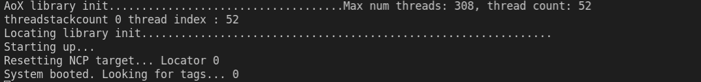
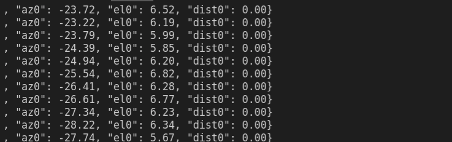

# TCC - Comparação de performance de técnicas de DoA
Nome: Rafael Pintar Alevato

Orientador: Richard Demo Souza

Coorientador: Pedro Lemos

Instituição: UFSC (Universidade Federal de Satana Catarina)

# Dependências

* Biblioteca Eigen: `git submodule update --init --recursive`

* Simplicity Commander: `./scripts/install_commander`

# Para rodar a aplicação

Após a instalação do Commander (./install_commander):

1. Conecte apenas o kit da âncora em uma porta USB e execute

    ```
    cd scripts/
    ./flash_firmware.sh ../anchor_firmware/bin/anchor-bootloader.s37
    ./flash_firmware.sh ../anchor_firmware/bin/anchor-firmware.s37
    ```

2. Desconecte o kit da âncora e conecte apenas o kit da tag em uma porta USB e execute

    ```
    ./flash_firmware.sh ../tag_firmware/bin/tag-firmware.s37
    ```

3. Desconecte o kit da tag e conecte novamente o Kit da âncora e verifique sua porta VCOM (Ex.: /dev/ttyACM0). Altere o arquivo "locator_config.txt" no diretório "main_application/config" e digite a porta COM na coluna "COM port"


4. Compile e execute a aplicação principal

    ```
    cd single_locator/
    make
    cd exe
    ./locator-host ../config/locator_config.txt
    ```

    Se o firmware da âncora tiver sido gravado corretamente você deve ver a saída:

    

5. Conecte novamente a tag ou alimente com bateria. Se tudo estiver correto você deve ver a saída dos ângulos processados

    
